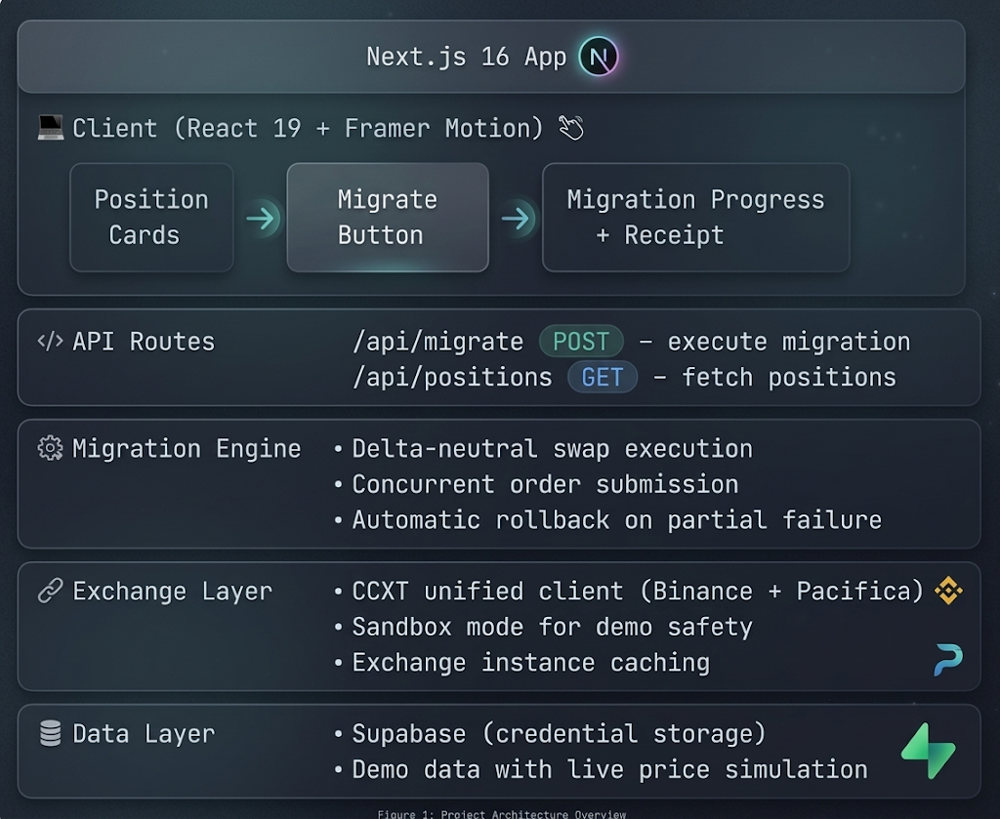

<p align="center">
  
</p>

<h1 align="center">⚡ PaciPort</h1>
<p align="center"><strong>1-Click Perpetual Position Migration</strong></p>

<p align="center">
  
  
  
  
  
</p>

> Migrate open perpetual positions from any exchange to Pacifica in **< 2 seconds**. Zero market exposure. Zero price risk.

PaciPort is a delta-neutral position migration engine built for the **Pacifica Exchange Hackathon**. It enables traders to teleport their open perp positions between exchanges with atomic, slippage-minimized execution — closing on the source and opening on the destination in parallel to maintain continuous market exposure.

---

## 🎯 Problem

Moving perpetual positions between crypto exchanges is a nightmare:

1. **Manual close → transfer → re-open** takes minutes, exposing traders to price risk
2. **No tooling exists** to atomically migrate positions across exchanges
3. **Sticky TVL** — exchanges benefit from the friction. Traders pay the cost

## 💡 Solution

PaciPort executes a **delta-neutral swap** — simultaneously closing a position on the source exchange and opening an identical position on the destination — achieving zero net market exposure during migration.

**Key features:**
- **Atomic 2-leg execution** — close source + open destination concurrently via `Promise.allSettled`
- **Automatic rollback** — if one leg fails, the other is reversed
- **Live price simulation** — real-time PnL updates on all positions
- **Migration receipt** — detailed execution report with slippage analysis
- **Fee savings calculator** — shows annual savings from lower maker/taker fees
- **Position teleport animation** — Framer Motion "teleport" effect as positions move between panels

---

## 🏗️ Architecture



---

## 🛠️ Tech Stack

| Layer       | Technology                         |
| ----------- | ---------------------------------- |
| Framework   | Next.js 16.2.2 (App Router)        |
| UI          | React 19.2.4                       |
| Styling     | Tailwind CSS v4 + CSS custom props |
| Animations  | Framer Motion 12                   |
| Exchange    | CCXT 4.5 (unified trading API)     |
| Backend     | Supabase (auth + credential vault) |
| Fonts       | Inter + JetBrains Mono             |
| Language    | TypeScript 5                       |

---

## 🚀 Getting Started

### Prerequisites

- **Node.js** ≥ 18
- **npm** ≥ 9

### Installation

```bash
git clone https://github.com/edycutjong/paciport.git
cd paciport
npm install
```

### Environment Variables

Create a `.env.local` file in the project root:

```env
# Supabase (optional — falls back to mock)
NEXT_PUBLIC_SUPABASE_URL=https://your-project.supabase.co
NEXT_PUBLIC_SUPABASE_ANON_KEY=your-anon-key
```

> **Note:** The app runs fully in demo mode without any environment variables. All exchange credentials are mocked and sandbox mode is enforced.

### Run Development Server

```bash
npm run dev
```

Open [http://localhost:3000](http://localhost:3000) to see the dashboard.

### Build for Production

```bash
npm run build
npm start
```

---

## 📁 Project Structure

```
paciport/
├── app/
│   ├── api/
│   │   ├── migrate/route.ts      # POST — execute position migration
│   │   └── positions/route.ts    # GET  — fetch live positions
│   ├── globals.css               # Design tokens + animations
│   ├── layout.tsx                # Root layout with metadata
│   └── page.tsx                  # Main dashboard (3-column layout)
├── components/
│   ├── ExchangePanelHeader.tsx   # Exchange connection status header
│   ├── MigrateButton.tsx         # Animated migration trigger
│   ├── MigrationProgress.tsx     # Step-by-step execution timeline
│   ├── MigrationReceipt.tsx      # Post-migration execution report
│   └── PositionCard.tsx          # Individual position display card
├── lib/
│   ├── demo-data.ts              # Demo positions + price simulator
│   ├── exchange-client.ts        # CCXT client factory + caching
│   ├── migration-engine.ts       # Core delta-neutral swap engine
│   ├── supabase.ts               # Supabase client + credential vault
│   └── types.ts                  # TypeScript interfaces
├── public/                       # Static assets
├── package.json
├── tsconfig.json
└── next.config.ts
```

---

## 📡 API Reference

### `POST /api/migrate`

Execute a delta-neutral position migration.

**Request Body:**

```json
{
  "positionIds": ["pos-sol-long", "pos-eth-short"],
  "sourceExchange": "binance",
  "destinationExchange": "pacifica",
  "maxSlippage": 0.1,
  "dryRun": false
}
```

**Response:**

```json
{
  "results": [
    {
      "id": "mig-1712592000000-a1b2c3",
      "status": "success",
      "position": { "..." },
      "sourceLeg": { "status": "filled", "fillPrice": 148.18, "slippage": 0.0135 },
      "destinationLeg": { "status": "filled", "fillPrice": 148.22, "slippage": 0.0135 },
      "executionTimeMs": 1412,
      "netSlippage": 0.0135
    }
  ],
  "summary": {
    "total": 1,
    "successful": 1,
    "failed": 0,
    "totalExecutionTimeMs": 1412,
    "allSuccess": true
  }
}
```

### `GET /api/positions`

Fetch all demo positions with live price updates.

---

## ⚙️ How the Migration Engine Works

1. **Select positions** on the source exchange panel (Binance)
2. **Click Migrate** → triggers `POST /api/migrate`
3. **Engine executes concurrently:**
   - **Source leg:** Close position on Binance (market sell for longs, market buy for shorts)
   - **Destination leg:** Open identical position on Pacifica (same size, same side)
4. **Atomic safety:**
   - Both legs execute via `Promise.allSettled`
   - If one leg fails and the other succeeds → automatic rollback
   - If both succeed → migration complete
5. **Receipt generated** with execution time, slippage per leg, and net slippage

### Demo Mode vs Live Mode

| Feature              | Demo Mode (`demo-user`)     | Live Mode (real `userId`)        |
| -------------------- | --------------------------- | -------------------------------- |
| Order execution      | Simulated (random slippage) | Real CCXT market orders          |
| Exchange connection  | Mocked credentials          | Decrypted from Supabase vault    |
| Sandbox mode         | Always on                   | Based on API key prefix          |
| Rollback             | Simulated                   | Real reverse orders              |

---

## 🎨 Design System

The UI uses a custom dark theme with CSS custom properties:

| Token              | Value     | Usage                      |
| ------------------ | --------- | -------------------------- |
| `--bg`             | `#09090b` | Page background            |
| `--surface`        | `#111113` | Card backgrounds           |
| `--primary`        | `#06b6d4` | Pacifica brand (cyan)      |
| `--migrate`        | `#3b82f6` | Migration action (blue)    |
| `--success`        | `#22c55e` | Positive PnL               |
| `--loss`           | `#ef4444` | Negative PnL               |
| `--speed-gold`     | `#fbbf24` | Fee savings highlight      |
| `--competitor`     | `#f59e0b` | Source exchange (amber)    |

**Fonts:** Inter (UI) + JetBrains Mono (data/numbers)

---

## 🏆 Hackathon Context

**Competition:** Pacifica Exchange Hackathon  
**Track:** DeFi / Exchange Tooling  
**Core Thesis:** Reduce TVL friction by making position migration instant, safe, and free — giving Pacifica a competitive acquisition channel for existing perp traders.

### Why Pacifica Should Care

- **TVL acquisition tool** — removes the #1 barrier to switching exchanges
- **Network effect** — each migration adds liquidity to Pacifica's order books  
- **Fee incentive** — savings calculator shows traders exactly how much they'd save annually

---

## 📄 License

MIT © 2026 [Edy Cu](https://github.com/edycutjong)
